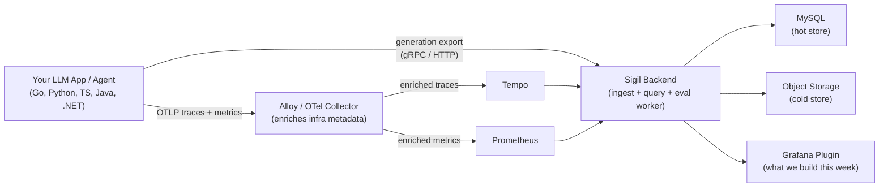

# Sigil Hackathon — Actually Useful AI Observability

*From "it hallucinated" to "here's exactly why."*

---

## Why We're Here

AI systems are black boxes until you instrument them. Every team building with LLMs hits the same wall: something goes wrong, and nobody can explain what happened, where, or why. The debugging story today is `print(response)` and prayer.

Sigil changes that. We're building a fully open-source, OpenTelemetry-native AI observability platform — inside Grafana. Conversation timelines, step-level trace drilldown, online evaluation with pluggable scorers, cost-per-token analytics. Five SDKs. Every major framework. Zero guesswork.

We're the Grafana Assistant team. We spent the last year building an AI agent loved by 20,000+ customers. We know what production AI needs because we run it ourselves — and we're going to instrument our own Assistant to eat our own dogfood with real production data.

The AI observability space is heating up — Braintrust, Langfuse, and others are racing to own it. Sigil is how Grafana takes the #1 spot: OTel-native from day one, deeply integrated into the observability stack millions of teams already run, and backed by the same open-source DNA that made Grafana the standard. No new vendor. No new dashboard. Just the AI observability layer the ecosystem is missing.

## Where Grafana Is Today — and Why It's Not Enough

Today, Grafana Cloud customers can get basic AI telemetry: metrics dashboards for token usage, latency, and error rates via OpenTelemetry and OpenLIT ingestion. This is Level 1 — *"Are calls succeeding, how fast, and how expensive?"*

For context on where we are and the gap we're closing, see:

- [AI Observability at Grafana — Current State (doc)](https://docs.google.com/document/d/1R4vYX3bqyg9dI8kikkZ2kM0yhXnPrhr6/edit)
- [AI Observability at Grafana — Current State (slides)](https://docs.google.com/presentation/d/1FrL-aKm7kIXlmGsoU9AH5hAynxf6cuaH/edit?slide=id.p1#slide=id.p1)

The bottom line: metrics alone don't answer the questions that matter. *"Why did the agent hallucinate in that conversation?"* *"Which prompt change caused the cost spike?"* *"Are my evaluations catching regressions?"* — you can't answer any of these from a dashboard of counters. Sigil exists to close this gap — to take Grafana from Level 1 (telemetry) all the way through conversation debugging, online evaluation, and closed-loop quality optimization.

## How Sigil Works (The 30-Second Version)



**SDKs** instrument your LLM app. They emit two streams: standard OTel traces/metrics (through Alloy/Collector to Tempo and Prometheus) and normalized generation records (directly to Sigil). The Sigil backend stores generations in MySQL (hot) and object storage (cold), runs online evaluation asynchronously, and serves query APIs. The **Grafana plugin** is the UI that ties it all together.

The backend, SDKs, ingest pipeline, query APIs, and online evaluation engine are all built and working. The plugin has foundational pages. **Our job is to make the frontend experience world-class.**

## Getting Started

The entire stack runs locally with Docker Compose. Synthetic SDK traffic (Go, Python, JS, Java, .NET) is continuously generated so you'll have realistic data from minute one.

```bash
mise run up        # starts everything: Grafana, Sigil, Tempo, Prometheus, Alloy, MySQL, MinIO, SDK traffic
```

Open Grafana at `http://localhost:3000` and navigate to the Sigil plugin. The plugin hot-reloads — edit TypeScript, save, see changes.

Additionally, we'll be instrumenting the Grafana Assistant with the Sigil SDK to get **real production data** flowing through the system. This means we'll be debugging our own AI agent with the tool we're building.

## What We're Building

### 1. High-Level Dashboard — "How is my AI doing?"

The first thing a user sees. At a glance, answer: *How much am I spending? How fast are my calls? Are things getting better or worse?*

- **Token cost** broken down by provider, model, and agent
- **Call rates** by provider, agent, and operation type
- **Version-over-version trends** — cost and latency improvements across deployments
- **Cache efficiency** — token cache hit rates, cache read/write volumes
- **Token usage distribution** — input vs output vs reasoning vs cache tokens
- **Error rates** by provider and error category

Filter everything by provider, model, agent, version, time range, and arbitrary infrastructure labels (namespace, cluster, service — anything Alloy enriches).

*Existing state:* Dashboard page with filter bar and metric grid is functional. Needs polish, richer panels, and the cost/version/cache views.

### 2. Conversation Debugging — "What went wrong in this conversation?"

This is the heart of the product and the biggest UX challenge. An agent conversation spans multiple traces and spans. Each step has an LLM completion with full input/output payloads. Users need to:

- **Search conversations** with powerful filters (by agent, model, error status, time range, metadata, feedback signals)
- **Browse a conversation timeline** — see every turn, every tool call, every LLM completion in chronological order
- **Drill into a single generation** — full prompt, response, token usage, latency, model config, system prompt, tool definitions
- **Link to trace context** — click through to the OTel trace/span in Tempo for the full distributed trace
- **Mesh OTel data with generation data** — the generation record has the rich payload; the trace has the distributed context and timing. Both need to be accessible from one view.

This requires serious UX taste. The data density is high. Progressive disclosure is key — show the conversation flow at a glance, let users expand into details on demand. Think: IDE debugger meets chat interface.

*Existing state:* Conversations page with search, list panel, and generation viewer is functional. Needs major UX refinement, trace linking, richer generation detail, and the "aha" debugging workflow.

### 3. Online Evaluation & Feedback — "Is my AI actually good?"

Online evaluation scores production generations asynchronously. The evaluation engine is fully built (LLM-as-judge, JSON schema, regex, heuristic evaluators). Now we need the UI to make it useful.

**Scores & Feedback in context:**
- Show evaluation scores directly on conversations and generations — visual quality signals (pass/fail badges, score indicators)
- Surface user feedback (thumbs up/down, annotations) alongside evaluation scores
- Make it easy to spot bad conversations — filter by low scores, negative feedback, failed evaluations

**High-level evaluation metrics:**
- Score trends over time — are we getting better or worse?
- Score distribution by evaluator, model, agent
- Failure rate trends and alerting signals
- Evaluation coverage — what percentage of traffic is being scored?

**Evaluation configuration UI:**
- Create and manage evaluators (LLM-as-judge prompts, schema validators, regex patterns, heuristics)
- Fork from predefined evaluator templates
- Configure online rules: which conversations get evaluated (filters + sampling), which evaluator runs, targeting by agent/model/metadata
- Enable/disable rules, manage evaluator lifecycle
- Configure judge provider and model selection

This is a configuration-heavy workflow. The UX needs to guide users through setting up their evaluation pipeline without making it feel like filling out a form. Good defaults, clear previews, and guardrails matter.

*Existing state:* Backend APIs are complete. No frontend UI for evaluation configuration or score display yet.

### 4. Deployment to Dev/Ops Cluster

Part of the hackathon is getting Sigil running in our development and operational Kubernetes cluster so we can use it daily with real Grafana Assistant traffic. This includes:

- Deploying Sigil backend, connecting to existing Tempo/Prometheus/MySQL infrastructure
- Configuring the Grafana plugin in our internal Grafana instance
- Wiring up the Assistant SDK instrumentation to point at the deployed Sigil
- Validating the end-to-end flow with real data

The goal: by the end of the hackathon, we're using Sigil to observe our own AI agent in a real environment.

## Ideas That Only We Can Build

The biggest advantage we have over every competitor is that we run a production AI agent at scale. We're not guessing what users need — we know, because we are the user. Dogfooding the Grafana Assistant through Sigil will surface ideas that no one else in the market is thinking about.

Here's one concrete example to set the tone:

**Token cache breakpoint detection.** LLM providers cache prompt prefixes to reduce cost and latency. When a conversation turn invalidates that cache (a tool result changes, context gets reordered, the system prompt drifts), token costs spike silently. Today, nobody can tell you *where* the cache broke in a conversation. No product on the market surfaces this. Sigil should. Imagine clicking into a conversation and seeing exactly which turn caused the cache miss — with the token delta and cost impact right there. This is the kind of insight that only comes from operating your own agent and feeling the pain firsthand.

We want more ideas like this. The first team meeting should be a brainstorm: what do we wish we could see when debugging the Assistant? Where do the existing tools fail us? Think about things like comparing conversations across agent versions, spotting regression patterns, diffing prompt behavior — anything where our operator experience gives us an unfair advantage.

The rule: if we can build something that makes us say *"I wish I had this yesterday,"* it will make every customer say the same thing.

## Market Context

We've done extensive analysis of the AI observability and evaluation landscape. Before diving in, read through these references to understand what exists, where the gaps are, and how Sigil is positioned:

- **[AI Observability + Evaluation Market Survey](docs/references/ai-observability-evaluation-market.md)** — deep survey of online/offline eval patterns, capability matrices, and platform deep dives (Langfuse, Braintrust, Arize Phoenix, LangSmith, Helicone, OpenLIT, and more).
- **[Competitive Benchmark](docs/references/competitive-benchmark.md)** — competitor snapshot with pros/cons and OTel GenAI semantic convention alignment.
- **[AI Observability Roadmap](docs/product-specs/ai-observability-roadmap.md)** — our maturity model from Level 1 (telemetry) through Level 5 (optimization), and where Sigil fits in each phase.

## The Bar

We're not building a prototype. We're building the product that will ship. Every component should be built with the quality and taste that makes someone say *"this is obviously better than everything else out there."*

This is open-source software that will represent Grafana in a new market. Make it count.

---

*Let's go build the best AI observability product in the world.*
