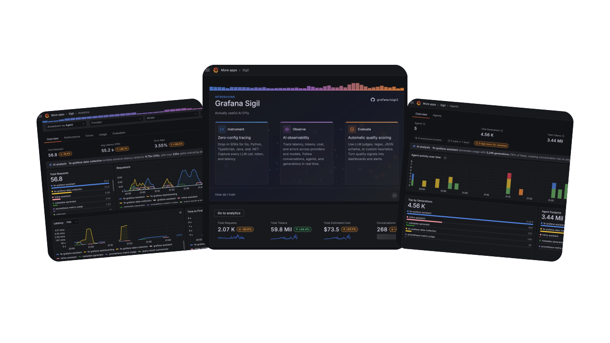
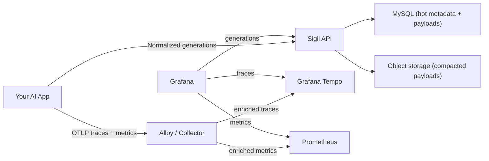

# Grafana Sigil

<p align="center">
  
</p>

Sigil is an open-source AI observability project from Grafana for teams running agents in production.

> It's actually useful AI o11y.

Instrument once with a thin OpenTelemetry-native SDK, then use Sigil to see what your agents are doing, what they cost, how quality is changing, and which conversations need attention.

## What You Get

- **Simple onboarding.** Sigil is a thin SDK layer on top of OpenTelemetry and the OTel GenAI semantic conventions, with helpers for common providers and frameworks. If you already have OTel, setup is small enough to do by hand or with coding assistants such as Claude Code or Cursor.
- **A single pane of glass for your agents.** See activity, latency, errors, token usage, cost, cache behavior, and quality in one place with filters for time range, provider, model, agent, and labels.
- **Conversation drilldown when something looks off.** Open any conversation to inspect the full thread, tool calls, traces, scores, ratings, annotations, token usage, and cost breakdowns.
- **Agent catalog and version history.** Sigil automatically groups agents, tracks versions, shows prompt and tool footprints, surfaces usage and cost per version, and helps you compare how an agent changes over time.
- **Actionable suggestions, not just dashboards.** Built-in insight bars flag anomalies and optimization opportunities around cost, cache, errors, and performance, and agent detail can rate a version's prompt/tool setup and suggest improvements.
- **Online evaluation on live traffic.** Score production generations continuously so you can monitor quality, catch regressions, and avoid manually reading every conversation.

## Why Sigil

- **OpenTelemetry-native**: Sigil follows the OTel GenAI semantic conventions, emits standard traces and metrics over OTLP, and works with existing OTel pipelines.
- **Generation-first**: normalized generation ingest lets Sigil correlate conversations, tool executions, traces, costs, and scores.
- **Version-aware agents**: prompt and tool changes become queryable agent versions, even when producers do not send a clean version string.
- **Built for production quality loops**: observability, agent understanding, ratings, annotations, and online evaluation live in the same workflow.
- **Open and composable**: Sigil fits naturally with Grafana, Alloy, Tempo, Prometheus, MySQL, and object storage.

## Included Components

- Grafana app plugin (`/apps/plugin`) for dashboards, conversations, agents, evaluations, and settings.
- Go service (`/sigil`) for generation ingest, query APIs, agent catalog APIs, and online evaluation workers.
- SDKs (`/sdks`) for Go, Python, TypeScript/JavaScript, Java, and .NET/C#:
  - OTel traces with AI-specific attributes (`gen_ai.*`).
  - OTel metrics: latency histograms and token usage distributions.
  - Structured generation export to Sigil.
- Alloy / OTel Collector as the telemetry pipeline for traces and metrics.
- Tempo (docker compose) as trace storage.
- Prometheus as metrics storage for SDK-emitted AI metrics.
- MySQL as default metadata and record-reference storage.
- Object storage for compacted payloads:
  - MinIO (default local/core profile)
  - AWS S3
  - Google Cloud Storage
  - Azure Blob Storage

## Architecture At A Glance



## Get Started (Local)

### Prerequisites

- [Docker](https://docs.docker.com/get-docker/) with Compose
- [mise](https://mise.jdx.dev/)

### 1. Clone the repository

```bash
git clone https://github.com/grafana/sigil.git
cd sigil
```

### 2. Install toolchain and dependencies

```bash
mise trust
mise install
mise run doctor:go
mise run deps
```

### 3. Start the local stack

```bash
mise run up
```

This starts Grafana, the Sigil app plugin, the Sigil API service, Alloy, Tempo, Prometheus, MySQL, and MinIO.
The `mise run up` task also enables Grafana development mode (`DEVELOPMENT=true`) and Docker Compose watch mode so plugin/frontend and plugin backend changes reload without manually restarting containers.
Local Compose config runs Tempo in multitenant mode and Alloy injects `X-Scope-OrgID: fake` on trace ingest so local query and ingest tenant semantics stay aligned.

### 4. Open the Sigil app

- Grafana: [http://localhost:3000](http://localhost:3000)
- Sigil app: [http://localhost:3000/a/grafana-sigil-app/conversations](http://localhost:3000/a/grafana-sigil-app/conversations)

Local default runs with anonymous Grafana auth enabled.

### 5. Verify the API is running

```bash
curl -s http://localhost:8080/healthz
curl -s http://localhost:8080/api/v1/conversations
curl -s http://localhost:8080/api/v1/completions
```

### 6. Run local hot/cold storage E2E

With `mise run up` still running in another terminal:

```bash
mise run test:e2e:storage-local
```

If compaction is slower on your machine, increase the wait budget:

```bash
SIGIL_E2E_COMPACTION_WAIT=5m mise run test:e2e:storage-local
```

## Deploy On Kubernetes (Helm)

The Sigil Helm chart lives in `charts/sigil`.

Basic install (defaults to `ghcr.io/grafana/sigil:latest`):

```bash
helm upgrade --install sigil ./charts/sigil \
  --namespace sigil \
  --create-namespace
```

To pin to an immutable published image from CI, set the image tag explicitly:

```bash
helm upgrade --install sigil ./charts/sigil \
  --namespace sigil \
  --create-namespace \
  --set image.tag=<git-sha>
```

Image publishing automation:

- GitHub Actions workflow: `.github/workflows/sigil-image-publish.yml`
- Trigger: pushes to `main` that touch `sigil/**` or workflow/go workspace files.
- Published tags: `ghcr.io/grafana/sigil:<git-sha>` and `ghcr.io/grafana/sigil:latest`
- Automatic deployment: triggers Argo workflow `deploy-sigil-stack` in `sigil-cd`, rolling out the published SHA-tagged image to `dev` and then `ops`.

Chart docs and reference:

- Chart usage: [`charts/sigil/README.md`](charts/sigil/README.md)
- Helm reference: [`docs/references/helm-chart.md`](docs/references/helm-chart.md)

## SDK Quick Examples

### TypeScript

```ts
import { SigilClient } from "@grafana/sigil-sdk-js";

const client = new SigilClient({
  generationExport: {
    protocol: "http",
    endpoint: "http://localhost:8080/api/v1/generations:export",
    auth: { mode: "tenant", tenantId: "dev-tenant" },
  },
});

// Configure OTEL exporters (traces/metrics) in your app OTEL setup.

await client.startGeneration(
  {
    conversationId: "conv-1",
    model: { provider: "openai", name: "gpt-5" },
  },
  async (recorder) => {
    recorder.setResult({
      output: [{ role: "assistant", content: "Hello from Sigil" }],
    });
  }
);

await client.shutdown();
```

### JavaScript

```js
import { SigilClient } from "@grafana/sigil-sdk-js";

const client = new SigilClient({
  generationExport: {
    protocol: "http",
    endpoint: "http://localhost:8080/api/v1/generations:export",
    auth: { mode: "tenant", tenantId: "dev-tenant" },
  },
});

await client.startGeneration(
  {
    conversationId: "conv-1",
    model: { provider: "openai", name: "gpt-5" },
  },
  async (recorder) => {
    recorder.setResult({
      output: [{ role: "assistant", content: "Hello from Sigil" }],
    });
  }
);

await client.shutdown();
```

### Go

```go
cfg := sigil.DefaultConfig()
cfg.GenerationExport.Protocol = sigil.GenerationExportProtocolHTTP
cfg.GenerationExport.Endpoint = "http://localhost:8080/api/v1/generations:export"
cfg.GenerationExport.Auth = sigil.AuthConfig{
	Mode:     sigil.ExportAuthModeTenant,
	TenantID: "dev-tenant",
}

client := sigil.NewClient(cfg)
defer func() { _ = client.Shutdown(context.Background()) }()

ctx, rec := client.StartGeneration(context.Background(), sigil.GenerationStart{
	ConversationID: "conv-1",
	Model:          sigil.ModelRef{Provider: "openai", Name: "gpt-5"},
})
defer rec.End()

rec.SetResult(sigil.Generation{
	Output: []sigil.Message{sigil.AssistantTextMessage("Hello from Sigil")},
}, nil)
```

### Python

```python
from sigil_sdk import Client, ClientConfig, GenerationStart, ModelRef, assistant_text_message

client = Client(
    ClientConfig(
        generation_export_endpoint="http://localhost:8080/api/v1/generations:export",
    )
)

with client.start_generation(
    GenerationStart(
        conversation_id="conv-1",
        model=ModelRef(provider="openai", name="gpt-5"),
    )
) as rec:
    rec.set_result(output=[assistant_text_message("Hello from Sigil")])

client.shutdown()
```

## SDKs We Support

- Go core SDK: [`sdks/go/README.md`](sdks/go/README.md)
- Python core SDK: [`sdks/python/README.md`](sdks/python/README.md)
- TypeScript/JavaScript SDK: [`sdks/js/README.md`](sdks/js/README.md)
- Java SDK: [`sdks/java/README.md`](sdks/java/README.md)
- .NET SDK: [`sdks/dotnet/README.md`](sdks/dotnet/README.md)

Provider helper docs:

- Go providers: OpenAI ([`sdks/go-providers/openai/README.md`](sdks/go-providers/openai/README.md)), Anthropic ([`sdks/go-providers/anthropic/README.md`](sdks/go-providers/anthropic/README.md)), Gemini ([`sdks/go-providers/gemini/README.md`](sdks/go-providers/gemini/README.md))
- Python providers: OpenAI ([`sdks/python-providers/openai/README.md`](sdks/python-providers/openai/README.md)), Anthropic ([`sdks/python-providers/anthropic/README.md`](sdks/python-providers/anthropic/README.md)), Gemini ([`sdks/python-providers/gemini/README.md`](sdks/python-providers/gemini/README.md))
- TypeScript/JavaScript providers: OpenAI ([`sdks/js/docs/providers/openai.md`](sdks/js/docs/providers/openai.md)), Anthropic ([`sdks/js/docs/providers/anthropic.md`](sdks/js/docs/providers/anthropic.md)), Gemini ([`sdks/js/docs/providers/gemini.md`](sdks/js/docs/providers/gemini.md))
- Java providers: OpenAI ([`sdks/java/providers/openai/README.md`](sdks/java/providers/openai/README.md)), Anthropic ([`sdks/java/providers/anthropic/README.md`](sdks/java/providers/anthropic/README.md)), Gemini ([`sdks/java/providers/gemini/README.md`](sdks/java/providers/gemini/README.md))
- .NET providers: OpenAI ([`sdks/dotnet/src/Grafana.Sigil.OpenAI/README.md`](sdks/dotnet/src/Grafana.Sigil.OpenAI/README.md)), Anthropic ([`sdks/dotnet/src/Grafana.Sigil.Anthropic/README.md`](sdks/dotnet/src/Grafana.Sigil.Anthropic/README.md)), Gemini ([`sdks/dotnet/src/Grafana.Sigil.Gemini/README.md`](sdks/dotnet/src/Grafana.Sigil.Gemini/README.md))

## Documentation

- Docs index: [`docs/index.md`](docs/index.md)
- Architecture and contracts: [`ARCHITECTURE.md`](ARCHITECTURE.md)
- Generation ingest reference: [`docs/references/generation-ingest-contract.md`](docs/references/generation-ingest-contract.md)
- Helm deployment reference: [`docs/references/helm-chart.md`](docs/references/helm-chart.md)

## Contributing

Forking and contribution workflow lives in [`CONTRIBUTING.md`](CONTRIBUTING.md).

## License

- Repository code is licensed under GNU AGPL v3.0. See [`LICENSE`](LICENSE).
- SDK subfolders under `sdks/` are licensed under Apache License 2.0. See [`sdks/LICENSE`](sdks/LICENSE).
